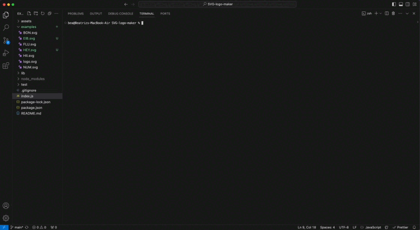

# SVG-Logo-Maker

[](https://opensource.org/licenses/MIT)

## Description

This repo was created to generate a simple logo from a command-line application. The user will input the 3-character acronym, the text color, shape of the logo, and the fill color of this shape. A .svg file is created with the logo taking all the inputs in account. A demo video can be found in the [Demo](#demo) section

## Table of Contents

- [Installation](#installation)
- [Usage](#usage)
- [Demo](#demo)
- [Credits](#credits)
- [License](#license)
- [How to Contribute](#how-to-contribute)
- [Tests](#tests)

## Installation

This command-line application needs npm to be installed and saved

```bash
npm init -y
npm i
npm inquirer@8
npm jest
```

## Usage

Initialize the command line application by:

```javascript
$ node index.js
```

Answer the prompt as they are displayed.

Note: When selecting a text color or a shape color, make sure to input the keyword for the color or the hexadecimal code with '#' infront of it.



## Demo

Link to [Walkthrough-video](#https://drive.google.com/file/d/1y1y50L2LoOybJBOoHWuppv3qY0T731_6/view?usp=sharing)

Example of a logo generated with this command-line application:


## Credits

validate color package downloaded from:

```javascript
$ npm i validate-color
```

## License

This application is covered under [MIT](https://choosealicense.com/licenses/mit/) license

## How to Contribute

If you have any questions, comments, or concerns please feel free to reach me at beatz.bravo@gmail.com. If you would like to contribute to my project, you can find my repo on [github.com/Beabravo](https://www.github.com/Beabravo)

## Tests

To run tests, run the following command

```bash
  npm run test
```
